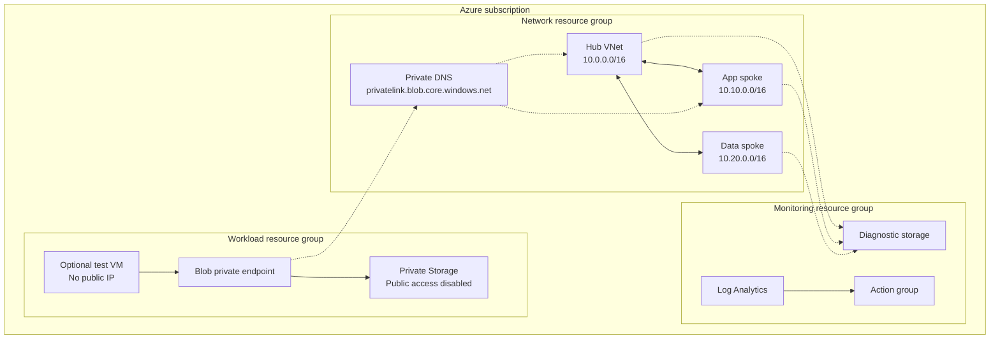

# Azure Secure Hub-Spoke

[](https://github.com/yossefseit/azure-secure-hub-spoke/actions/workflows/validate.yml)

A private-by-default Azure network foundation implemented with modular Bicep. The lab combines Azure administration, networking, and security controls without presenting Microsoft course exercises as original work.

## Status

| Area | Status | Evidence |
|---|---|---|
| Modular Bicep implementation | Implemented | `infra/main.bicep` and reusable modules |
| Offline lint and compilation | Automated | GitHub Actions workflow |
| Authenticated Azure validation | Pending | Requires an authorized subscription |
| Azure `what-if` review | Pending | Performed by `scripts/deploy.sh` before deployment |
| Live deployment | Pending | No cloud deployment is claimed yet |
| Private DNS and HTTPS test | Prepared | Optional ephemeral VM and validation script |

## What this project demonstrates

- Hub-and-spoke topology with dedicated hub, application, and data VNets
- Bidirectional hub-to-spoke peering without direct spoke-to-spoke connectivity
- Workload and private-endpoint subnet separation
- NSGs that allow approved traffic before denying other lateral VNet traffic
- No public IP resources and explicit private-subnet outbound behavior
- Private Blob Storage access through Private Link and Azure Private DNS
- Shared-key-disabled application storage with TLS 1.2, versioning, and soft delete
- Log Analytics, an action group, and hardened diagnostic storage
- Optional current-generation **VNet flow logs**, disabled until an existing Network Watcher is confirmed
- An optional, temporary private VM for DNS and endpoint reachability tests
- CI linting, Bicep compilation, pre-deployment `what-if`, scoped teardown, and cost guardrails

## Architecture



The peerings are intentionally non-transitive. The app and data spokes cannot route through the hub without a routing service such as Azure Firewall, an NVA, or Virtual WAN. Those services are excluded from the default lab because they materially increase cost.

See [architecture details](docs/architecture.md) and the [security model](docs/security.md).

## Repository structure

```text
.
├── .github/workflows/validate.yml
├── docs/
│   ├── architecture.md
│   ├── costs.md
│   ├── runbook.md
│   ├── security.md
│   └── validation.md
├── infra/
│   ├── environments/lab.bicepparam
│   ├── modules/
│   └── main.bicep
├── scripts/
│   ├── deploy.sh
│   ├── destroy.sh
│   ├── test-connectivity.sh
│   └── validate.sh
├── bicepconfig.json
└── README.md
```

## Prerequisites

- An Azure subscription that you own or are explicitly authorized to use
- Subscription-level permission to create resource groups and their resources
- Azure CLI with Bicep support
- Bash, Git, and an SSH public key only if the temporary VM is enabled

Do not deploy personal lab resources into an employer subscription without authorization.

## Validate locally

```bash
git clone https://github.com/yossefseit/azure-secure-hub-spoke.git
cd azure-secure-hub-spoke
chmod +x scripts/*.sh
./scripts/validate.sh
```

This lints and compiles the Bicep without creating Azure resources. When `AZURE_SUBSCRIPTION_ID` is set and Azure CLI is authenticated, it also runs Resource Manager preflight validation.

## Review and deploy

```bash
export AZURE_SUBSCRIPTION_ID="<authorized-subscription-id>"
export DEPLOYMENT_LOCATION="eastus2"
./scripts/deploy.sh
```

The script:

1. Pins Azure CLI to the exact subscription ID.
2. Lints, compiles, and validates the Bicep.
3. displays an Azure Resource Manager `what-if` preview.
4. Requires an explicit `DEPLOY` confirmation.
5. Creates a named subscription-level deployment.

No VM, flow log, Firewall, VPN Gateway, or Bastion resource is enabled by default.

## Validate private connectivity

Temporarily set `deployTestVm = true` and provide an SSH public key in a local, untracked `.bicepparam` file. Deploy, then run:

```bash
export AZURE_SUBSCRIPTION_ID="<authorized-subscription-id>"
./scripts/test-connectivity.sh
```

The script uses Azure VM Run Command—no public IP or inbound SSH rule—to verify that the Blob hostname resolves privately and that HTTPS reaches the endpoint. Remove the VM immediately after recording evidence.

## Clean up

```bash
export AZURE_SUBSCRIPTION_ID="<authorized-subscription-id>"
PREFIX="ashs" ENVIRONMENT="lab" ./scripts/destroy.sh
```

The cleanup script derives exactly three project resource-group names, displays them, and requires the confirmation phrase `DELETE ashs-lab`. It does not delete arbitrary tagged resources or an entire subscription.

## Cost controls

The default template avoids the lab’s major cost drivers:

- no Azure Firewall
- no VPN Gateway or ExpressRoute
- no Bastion
- no NAT Gateway or public IP
- no always-on VM
- no Traffic Analytics
- seven-day flow-log retention when explicitly enabled

Storage transactions, Private Link, Log Analytics ingestion, and optional compute can still incur charges. Review [cost controls and teardown timing](docs/costs.md) before deployment.

## Evidence checklist

After an authorized deployment, add redacted evidence under `docs/evidence/`:

- successful GitHub Actions run
- Bicep `what-if` summary
- deployed resource-group overview
- VNet topology and peering status
- storage public-network setting and private endpoint approval
- private DNS resolution from the temporary VM
- expected HTTPS response from the private endpoint
- teardown confirmation and final cost review

Never publish subscription IDs, tenant IDs, access tokens, SSH keys, public IPs, or unredacted corporate information.

## Design references

- [Hub-spoke network topology](https://learn.microsoft.com/azure/architecture/networking/architecture/hub-spoke)
- [Private Link and DNS integration at scale](https://learn.microsoft.com/azure/cloud-adoption-framework/ready/azure-best-practices/private-link-and-dns-integration-at-scale)
- [Bicep best practices](https://learn.microsoft.com/azure/azure-resource-manager/bicep/best-practices)
- [Bicep modules](https://learn.microsoft.com/azure/azure-resource-manager/bicep/modules)
- [Azure Resource Manager what-if](https://learn.microsoft.com/azure/azure-resource-manager/bicep/deploy-what-if)
- [Virtual Network flow logs](https://learn.microsoft.com/azure/network-watcher/vnet-flow-logs-overview)
- [Azure Storage private endpoints](https://learn.microsoft.com/azure/storage/common/storage-private-endpoints)

## License

Code and original documentation are available under the [MIT License](LICENSE). Microsoft course repositories are referenced as learning sources; their instructions are not copied into this project.

