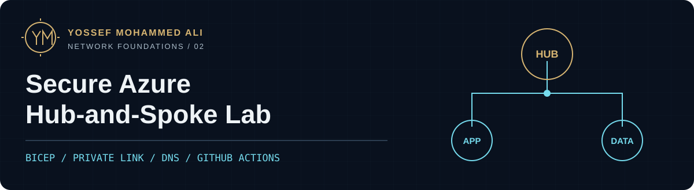
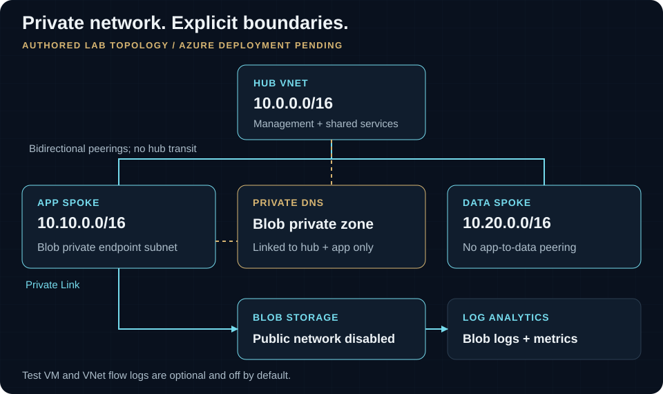

# Secure Azure Hub-and-Spoke Lab

> Lab: CI validated; Azure deployment pending

A private-by-default network foundation for separating application and data workloads while keeping Blob Storage off the public network. I authored the modular Bicep, Bash and PowerShell lifecycle scripts, and offline checks as a personal infrastructure lab.

[Case study](https://yossefseit.github.io/projects/azure-secure-hub-spoke/) · [Code](infra/main.bicep) · [Pipeline evidence](https://github.com/yossefseit/azure-secure-hub-spoke/actions/runs/30944553717) · [Deployment guide](docs/deployment-guide.md)

[](https://github.com/yossefseit/azure-secure-hub-spoke/actions/workflows/validate.yml)

| Focus | Implementation |
| --- | --- |
| Network boundaries | Three VNets, hub-to-spoke peering, NSGs, ASGs and explicit cross-spoke blackhole routes |
| Private service access | Blob private endpoint, private DNS, public access disabled and shared-key authentication disabled |
| Operational discipline | Offline CI, subscription checks, reviewed `what-if`, confirmation gates and ownership-checked teardown |

## Architecture



The hub peers in both directions with each spoke. Peering is **non-transitive**: there is no app-to-data peering and no routing service in the hub. Each spoke has workload and private-endpoint subnets, NSGs, an ASG, and a route that blackholes the other spoke prefix.

The Blob private endpoint sits in the app spoke. Its private DNS zone links only to the hub and app VNets; the data spoke has no route to that endpoint. Blob audit logs and transaction metrics target Log Analytics. An action group, resource-group deletion alert, and hardened diagnostic storage complete the monitoring baseline. The diagram omits resource-group containers and optional components for readability.

[Detailed address plan and architecture](docs/architecture.md) · [Original detailed SVG](diagrams/azure-secure-hub-spoke.svg) · [Editable Draw.io source](diagrams/azure-secure-hub-spoke.drawio)

## Decisions and boundaries

- **Segmentation before transit.** Excluding Azure Firewall, an NVA and gateways keeps this lab smaller. It also means there is no centrally inspected transit path; hub peering alone does not provide one.
- **Private by default.** No public IP resources. Application storage disables public networking and shared keys, requires TLS 1.2, and enables versioning and soft delete.
- **Optional validation compute.** `deployTestVm = false` by default. The temporary private Ubuntu VM joins the app workload ASG and is reached through VM Run Command. Enabling it also temporarily permits platform default outbound access on the app workload subnet for the VM agent.
- **Optional flow logs.** `enableVnetFlowLogs = false` by default. Current-generation VNet flow logs require an existing regional Network Watcher. Traffic Analytics stays disabled; flow-log retention is seven days when enabled.
- **Scoped lifecycle.** Canonical tags override caller tags. Cleanup checks exact names, ownership and inventory before deleting anything; it never targets an entire subscription.

This is my personal lab design. It does not describe an employer environment. See [security decisions](docs/security-decisions.md), [security model](docs/security.md), and [cost estimate](docs/cost-estimate.md).

## Quick start: offline validation

For local checks, install Git, Bash and Azure CLI with Bicep support. CI pins Bicep **0.46.1**. PowerShell 7 is available as an alternative script path; ShellCheck and PSScriptAnalyzer provide the additional checks used by CI.

```bash
git clone https://github.com/yossefseit/azure-secure-hub-spoke.git
cd azure-secure-hub-spoke
az bicep install --version v0.46.1

# Keep this invocation offline even if the variable exists in your shell.
env -u AZURE_SUBSCRIPTION_ID bash scripts/validate.sh
az bicep build-params --file infra/environments/lab.bicepparam \
  --outfile /tmp/azure-secure-hub-spoke.parameters.json
bash tests/cleanup-failure-guards.sh
```

Installing Bicep can download that tool. The subsequent commands do not authenticate to Azure or call Resource Manager: `validate.sh` lints and compiles Bicep, while clearing `AZURE_SUBSCRIPTION_ID` for that process skips authenticated preflight validation. `scripts/validate.ps1` provides the PowerShell path; leave that environment variable unset for offline use. Run [the complete validation checklist](docs/testing.md) before a deployment review.

## Validation evidence

| Evidence | Result |
| --- | --- |
| Public `main` CI, **4 Aug 2026**, commit `65439c6` | [Successful validation run](https://github.com/yossefseit/azure-secure-hub-spoke/actions/runs/30944553717) |
| Bicep and parameter compilation, shell/PowerShell checks, Markdown links and secret scan | Executed by the linked workflow |
| Cleanup failure paths | Exercised offline with a mock Azure CLI |
| Authenticated ARM validation and `what-if` | Pending |
| Azure deployment, private DNS/HTTPS, isolation and live teardown | Pending |

The dated run describes its linked commit. The workflow badge follows the current public branch. Neither proves Azure deployment or validates unpublished local changes. [Validation record](docs/validation.md) contains the runtime evidence checklist and the earlier successful baseline run.

## Deployment and connectivity runbook

These steps require a personally owned or explicitly authorized lab subscription, subscription-level resource creation permissions, a reviewed cost window, and an already-active Azure CLI context matching the supplied ID. An SSH public key is needed only for the optional VM. The scripts never switch subscriptions.

```bash
export AZURE_SUBSCRIPTION_ID="<authorized-subscription-id>"
bash scripts/deploy.sh
```

The wrapper checks the active subscription, lints and compiles Bicep, runs ARM validation, shows `what-if`, and requires the exact `DEPLOY` confirmation before creating the subscription deployment. `DEPLOYMENT_LOCATION` controls the deployment-record location; the Bicep `location` parameter controls resource location.

To validate private connectivity, use an untracked local parameter file to temporarily enable `deployTestVm` and supply an SSH public key. After an authorized deployment:

```bash
bash scripts/test-connectivity.sh
```

The test requires the Blob hostname to resolve to an RFC1918 address and HTTPS to return an expected authentication/client error rather than a timeout. It uses VM Run Command with no public IP or inbound SSH rule. Remove the temporary VM after collecting sanitized evidence. PowerShell equivalents and parameter handling are in the [deployment guide](docs/deployment-guide.md) and [runbook](docs/runbook.md).

## Teardown and costs

```bash
export AZURE_SUBSCRIPTION_ID="<authorized-subscription-id>"
PREFIX="ashs" ENVIRONMENT="lab" bash scripts/destroy.sh
```

Cleanup derives three exact project resource-group names, verifies their canonical tags and every contained resource, removes only name-and-tag-matched optional flow logs from the existing Network Watcher group, and requires `DELETE ashs-lab`. Authentication, inventory, ownership or deletion errors stop the process. Live teardown remains untested. [Cleanup runbook](docs/cleanup.md)

The defaults exclude Firewall, VPN/ExpressRoute, Bastion, NAT Gateway, public IPs, always-on VMs and Traffic Analytics. **Private Link, storage transactions and Log Analytics can still incur charges.** Review the [USD 5 deployment limit and evidence requirements](docs/cost-estimate.md) and [cost controls](docs/costs.md) before deployment.

## What I learned

- A convincing network diagram must distinguish peering, routing and name resolution. Each has a different failure mode and evidence requirement.
- Private access needs deliberate DNS links and a testable endpoint path, alongside the storage network setting.
- Cleanup deserves the same design attention as deployment. Exact ownership checks and failure-path tests make the lab lifecycle reviewable before Azure access is available.

## Documentation map

| Need | Start here |
| --- | --- |
| Understand implementation | [Architecture](docs/architecture.md), [security](docs/security.md), [decisions](docs/security-decisions.md) |
| Operate the lab | [Deployment](docs/deployment-guide.md), [runbook](docs/runbook.md), [cleanup](docs/cleanup.md), [troubleshooting](docs/troubleshooting.md) |
| Assess evidence and cost | [Testing](docs/testing.md), [validation](docs/validation.md), [costs](docs/costs.md), [cost estimate](docs/cost-estimate.md) |
| Read source | [Subscription orchestration](infra/main.bicep), [modules](infra/modules/), [parameters](infra/environments/lab.bicepparam), [scripts](scripts/), [guard tests](tests/cleanup-failure-guards.sh) |

After an authorized deployment, record dated, sanitized evidence for `what-if`, resource groups, peerings, storage exposure, endpoint approval, DNS/HTTPS reachability, isolation, teardown and costs. Do not commit identifiers, tokens, SSH keys, public IPs, raw Azure output or corporate information.

## Design references

- [Hub-spoke network topology](https://learn.microsoft.com/azure/architecture/networking/architecture/hub-spoke)
- [Private Link and DNS integration at scale](https://learn.microsoft.com/azure/cloud-adoption-framework/ready/azure-best-practices/private-link-and-dns-integration-at-scale)
- [Bicep best practices](https://learn.microsoft.com/azure/azure-resource-manager/bicep/best-practices)
- [Bicep modules](https://learn.microsoft.com/azure/azure-resource-manager/bicep/modules)
- [Azure Resource Manager what-if](https://learn.microsoft.com/azure/azure-resource-manager/bicep/deploy-what-if)
- [Virtual Network flow logs](https://learn.microsoft.com/azure/network-watcher/vnet-flow-logs-overview)
- [Azure Storage private endpoints](https://learn.microsoft.com/azure/storage/common/storage-private-endpoints)
- [Default outbound access in Azure](https://learn.microsoft.com/azure/virtual-network/ip-services/default-outbound-access)
- [Private Endpoint network policies](https://learn.microsoft.com/azure/private-link/disable-private-endpoint-network-policy)
- [Azure RBAC best practices](https://learn.microsoft.com/azure/role-based-access-control/best-practices)

## License and author

Code and original documentation remain under the [MIT License](LICENSE).

**Yossef Mohammed Ali** · [Portfolio](https://yossefseit.github.io/) · [Download CV](https://yossefseit.github.io/Yossef_Mohammed_Ali_CV.pdf)
